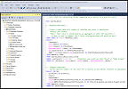

[ LinkedIn](https://www.linkedin.com/in/fredrich-passow-4789146)
 &nbsp; &nbsp; &nbsp; 
[ GitHub](https://github.com/fpassow)
 &nbsp; &nbsp; &nbsp; 
 [ Kaggle](https://www.kaggle.com/fritzpassow/code)
  &nbsp; &nbsp; &nbsp; 
[ About Me](about_me.html)

# Projects

## [Recipe Ingredients Analysis](https://www.kaggle.com/fritzpassow/recipe-ingredients-analysis)

Analyze ingredient lists from a free recipes dataset on Kaggle using Python, Pandas, and Seaborn. The main analysis is [on Kaggle, here](https://www.kaggle.com/fritzpassow/recipe-ingredients-analysis) . And some exported data can be explored on [Tableau Public, here](https://public.tableau.com/app/profile/fritz1693/viz/IngredientFrequenciesbyCuisine/IngredientFrequenciesbyCuisine#1).
 

 

## [Exploring Covid Data with SQL](https://fpassow.github.io/world_data/owid_covid/queries_and_results.html)

Download data using curl

Use a script to load or update SQL Server

Agregate daily data to monthly

And then look for countries and months with high infection rates, vaccination rates, or death rates

Everything is in [this github repo](https://github.com/fpassow/world_data/tree/main/owid_covid) and the analysis is presented 
[in a markdown page here](https://fpassow.github.io/world_data/owid_covid/queries_and_results.html)
 

 

## [Using Kroger's API](https://www.kaggle.com/code/fritzpassow/using-kroger-s-api)

Kroger is a midwestern grocery chain that offers a public REST API. This Kaggle notebook demonstrates how access the API using very simple Oauth authentication and how fetch information on Kroger stores and products. This data might be useful for data analisys related to food, prices, and geographic trends.
 

 

## [Explore frequencies of US baby names from US Social Security data using SQL and Tableau](https://www.kaggle.com/fritzpassow/baby-names-sql-and-tableau)
Use SQL to [extract an interesting subset of data from a Sqlite database on Kaggle](https://www.kaggle.com/fritzpassow/baby-names-sql-and-tableau). 

Then [analyze with Tableau Public](https://public.tableau.com/app/profile/fritz1693/viz/BabyNamesbyStateandYear/BabyNamesbyStateandYear). 

 

## [Explore US baby names with SQL and Pandas](https://www.kaggle.com/fritzpassow/explore-us-baby-names-with-sql-and-pandas)
Kaggle has some Sqlite datasets. These are fun to play with and the results are easy to share. This notebook does some analysis of Social Security names data, first with SQL and then with Pandas.
 

 

## [Some Statistics on D&D Spells](https://www.kaggle.com/fritzpassow/some-statistics-on-d-d-spells)

No earth-shattering insights here. Just some practice slicing, dicing, and graphing with Python, Pandas, and Seaborn.
 

 

## [Google Data Analytics Certificate: Final Project](https://fpassow.github.io/google_cert_project/)

Analyze rides data from a fictional bike-share company using R and Excel.
 

 

# Writing

## [R Notes for Programmers](https://docs.google.com/document/d/1G2h8k4SuW2E9RkhKtU9p3ehNwLWADwG2YjW7fM46O60/edit?usp=sharing)
Quick facts about the R programming language, summarized for people who already know other languages. I started learning R because the Google
Data Analyst Certification course uses it. But all the R courses I found were also teaching how to program. So I took time out to
research the question of "what kind of language is R?", so I could stop wondering about these things while doing the lessons.

## [Mnemonic for SQL Query Order of Execution](SQL_execution_order_mnemonic.jpg)

For me, the order of execution finally explained why some things are legal or illegal in various part of a query. For example, the fact that I can't use a name created by an AS clause if the SELECT line that contains it hasn't run yet. Credit to https://www.mnemonicgenerator.com/ for some early ideas.

## [Bootstrap for Engineers](https://fpassow.github.io/bootstrap4engineers.html)
How non-designers can easily use [Bootstrap](https://getbootstrap.com) to modernize the look
of bare HTML.

# Certifications

[ LinkedIn](https://www.linkedin.com/in/fredrich-passow-4789146)
 &nbsp; &nbsp; &nbsp; 
[ GitHub](https://github.com/fpassow)
 &nbsp; &nbsp; &nbsp; 
 [ Kaggle](https://www.kaggle.com/fritzpassow/code)
  &nbsp; &nbsp; &nbsp; 
[ About Me](about_me.html)
